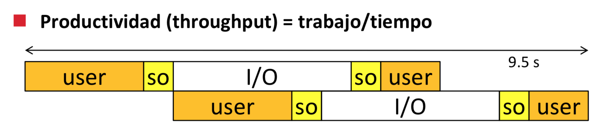
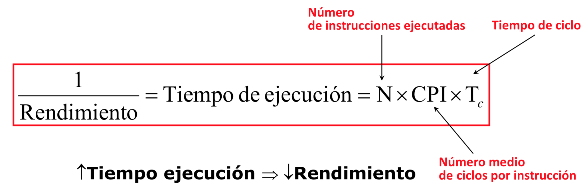

Los chinos van a dominar el mundo.

El primo informático va a dominar el mundo.

## Mediciones

| Nombre | Símbolo | 2^x |10^x| Error |
|---|------|---|-----|-|-|
| Kilo | K | 2^10 -> 1024 | 10^3 -> 1000 | 2,4% |

Depende de dónde esté un KB son 1000 (DISCO) o 1024 (RAM). Los vendedores no te engañan, depende de lo que compres es una medida u otra.

## Von Neumann

La memoria se accede por dirección. Los programas están cargados en memoria. (...)

<p align="center">
	
</p>

> "Debuga esto. Mal rollo."

<p align="center">
	
</p>

> "Cada bombilla consume un huevo... Y un huevo por mucho... Mal rollo."

## Evaluación de un sistema

#### Coste

El coste viene dado por:
- Tamaño del dado (el centro de un chip)
- La complejidad del dado (cuantas más capas y más transistores más caro)
- Coste ambiental y social

#### Rendimiento

```
1 / tiempo que tarda en fabricarse
```

Viene dado por:

- Jerarquía de memoria
- Paralelismo
- Segmentación

#### Consumo

Energía consumida en `Watts`.

#### Fiabilidad

```
Tiempo entre fallos / reparaciones
```

## Tecnología de fabricación

Nuestros sistemas están basados en CMOS.

<p align="center">
	
</p>

## Proceso de fabricación de un chip

<p align="center">
	
</p>

## Ecuaciones

<p align="center">
	
</p>

## Ley de Moore

La razón de que no se cumpla la ley de Moore actualmente es que no sale rentable económicamente.

## Latencia vs Ancho de banda

### Latencia
Ping --> 10ms

Ferrari --> 3600s

Camión --> 10.800s

### Ancho de banda
ADSL 20Mb/s --> 2,5MB/s

Ferrari --> 277,8 MB/s

Camión --> 3,15 TB/s

## Segmentación

<p align="center">
	
</p>

> Yo puedo empezar un proceso siempre que el SO esté libre para manejarlo.

<p align="center">
	
</p>

## Tiempo de ejecución (rendimiento)

<p align="center">
	
</p>

<p align="center">
	
</p>

## Rendimiento

<p align="center">
	
</p>

<p align="center">
	
</p>

## Comparación de rendimiento

<p align="center">
	
</p>

## Ley de Amdahl

> Leer capítulo 1 de H&P

Si yo solo toco una subrutina y la mejoro y todo lo demás lo dejo igual. La ganancia sería cuanto se reduce el tiempo de la subrutina.

Si el porcentaje de lo que tarda no és grande. No vale la pena mejorarlo. Es decir, céntrate en aquello que tarda más.

<p align="center">
	
</p>

¿Cuál es la parte más rentable de mejorar? Aquella que ocupe la mayoría de tiempo.

<p align="center">
	
</p>

## Consumo

La energía se mide en **Joules**

La potencia se mide en **Joules/seg => Watts**

Si la potencia es constante:
```
Energía = Potencia * t
```

La potencia consumida por un CMOS depende de:
- Conmutación (cambiar de estado 1 a 0, o viceversa)
- Corriente de fugas (disipación al no ser ideales)
- Corriente de cortocircuito (...?!)

<p align="center">
	
</p>

<p align="center">
	
</p>

<p align="center">
	
</p>

## Fiabilidad

Fiabilidad es el tiempo de funcionamiento continuo sin fallos. Para analizarlo tenemos que tener una:

#### Tasa de fallos

```
Tasa de fallos = 1 / tiempo medio de fallo
```

No es difícil no? Ahora en inglés.

**MTTF** --> Mean Time To Failure
**MTTR** --> Mean Time To Repair
**MTBF** --> Mean Time Between Failures

#### Disponibilidad

```
Disponibilidad = Tiempo medio de fallo / (Tiempo medio de fallo + Tiempo medio de Reparación)
```

#### Estadística

Este tiempo de fallo, se distribuye exponencialmente (PE be like). Por lo tanto, tenemos que:

<p align="center">
	
</p>

#### Calcular el MTTF de un sistema

<p align="center">
	
</p>

#### Redundancia

Para mejorar el MTTF de un sistema se puede hacer de dos maneras.
1. Vuelvo a calcular el resultado para ver si es correcto **(gastas más tiempo)**.
2. Disponer de elementos extra para reemplazar al que falla **(gastas en recursos)**.

##### Ejemplo

<p align="center">
	
</p>
