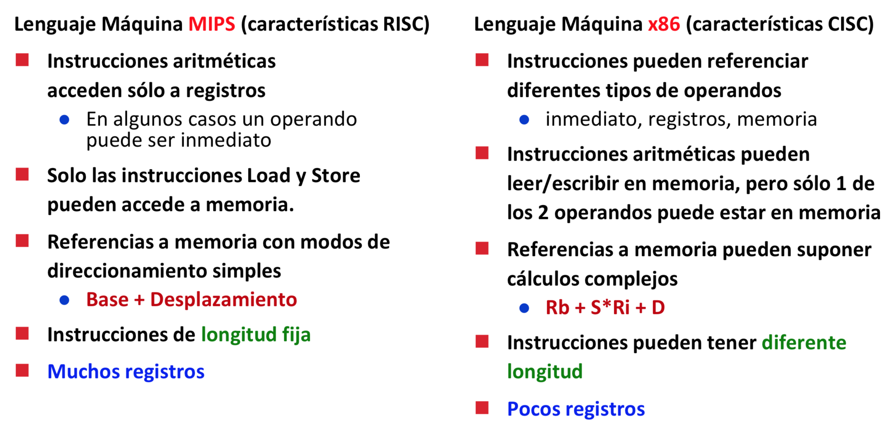
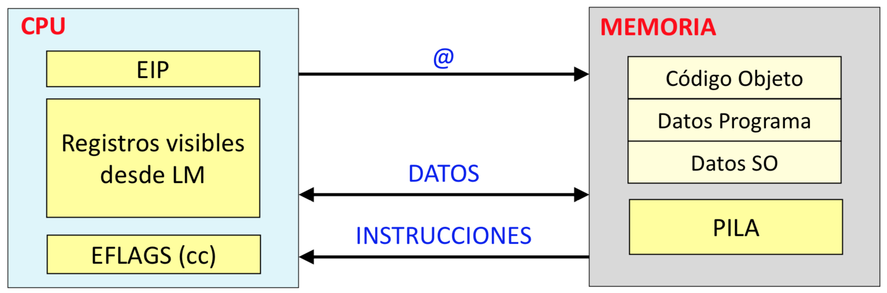
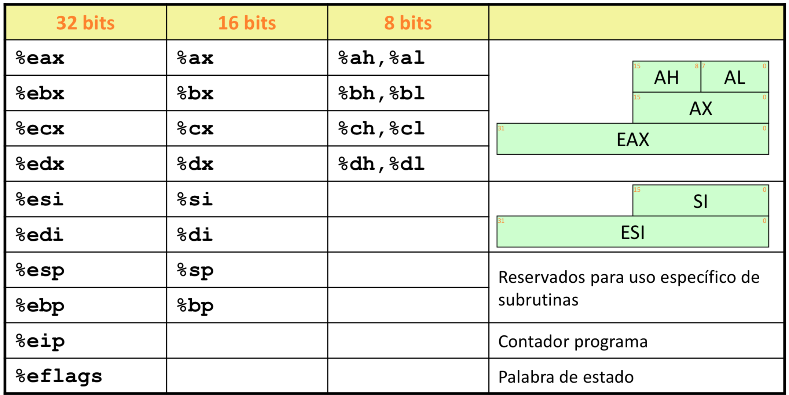
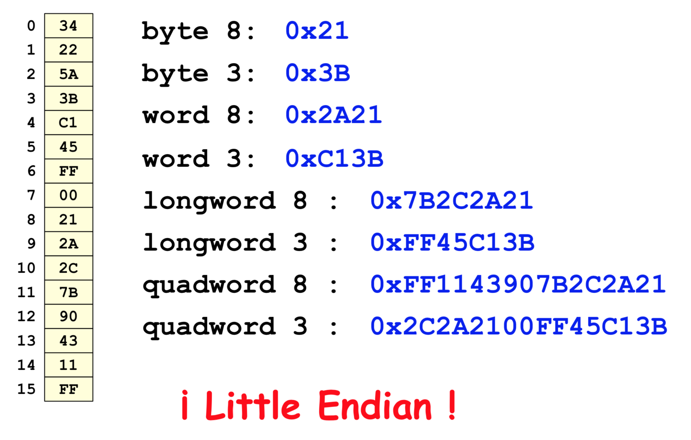
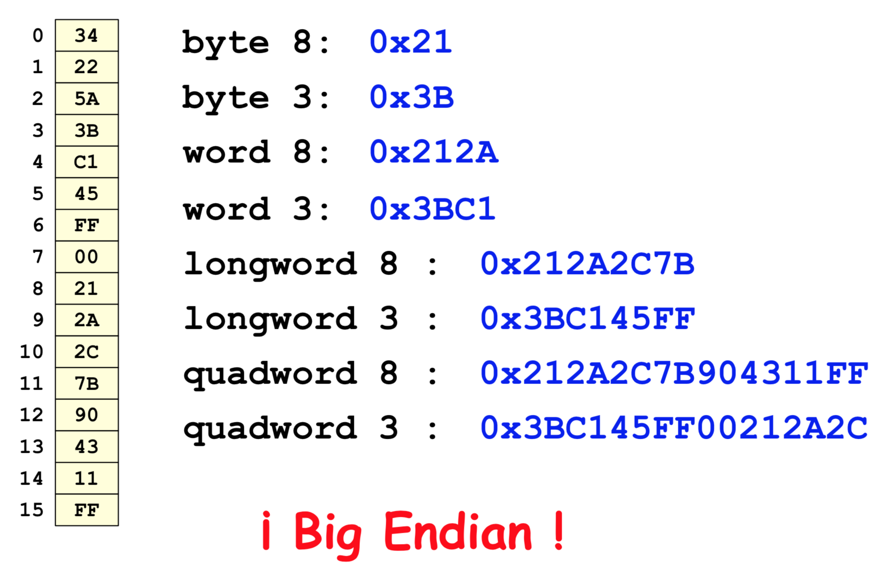
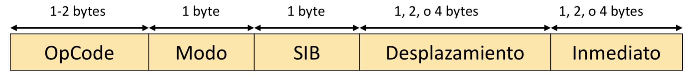
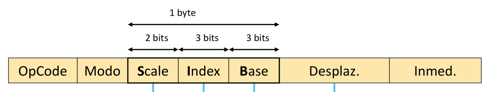

## Lenguaje máquina (x86)

### Historia

#### IBM - i8086

IBM se hizo con el mercado con el procesador de **16 bits** llamado i8086.

Era de números enteros, **no podías hacer operaciones aritméticas con decimales** (solo podías simularlas).

Hizo un **chip aritmético** para aumentar la velocidad de computación.

#### IBM - i80286

Aumenta el espacio de direcciones a **24 bits**.

#### IBM - i80386 (el de las prácticas)

Se extiende a **32 bits**. Todos **los registros sirven para todo**.

> Recordad que en las prácticas hay que poner la opción -m32 para compilar con 32 bits.

#### Intel - Pentium MMX (1997)

Intel hizo un conjunto de instrucciones **(instrucciones multimedia)** para procesamiento vectorial de datos. Es decir, con una sola operación se podían modificar vectores.

#### AMD (2003)

Extiende a **64 bits**.

### Instrucciones

Lenguaje máquina x86 que usaremos es CISC.

Por lo tanto hay diferencias:

<p align="center">
	
</p>

<p align="center">
	
</p>

#### Tipos de datos

- Enteros
- Reales (con coma flotante)

Cada tipo de dato tiene un rango de número que caben dentro (ambos incluidos):
- Naturales:
	- byte: 0 .. 255
	- word: 0 .. 65.535
	- long: 0 .. 4.294.967.215
- Enteros:
	- byte: -128 .. 127
	- word: -32.768 .. 32.767
	- long: -2.147.483.648 .. 2.147.483.647
- Reales:
	- byte (32 bits): 1,18\*10^-38 .. 3,40\*10^38
	- word (64 bits): 2,23\*10^-308 .. 1,79\*10^308
	- long (80 bits): 3,37\*10^-4932 .. 1,18\*10^-4932

> MOV[ B (8 bits)| L (32 bits)|W (16 bits) ]

// TO-DO: revisar (arriba)

No hay structs, ni matrices, ni ningún tipo estructurado

#### Registros

<p align="center">
	
</p>

// TO-DO: revisar (arriba)

##### Son registros little endian

<p align="center">
	
	
</p>

#### Ejemplos de instrucciones

```assembly
// Inmediatos
$19
$-3
$0x2A
$0x2A45

// Registros
%eax
%ah
%esi

// Memoria:  D(Rb, Ri, s) -> M[Rb + Ri * s + D]
a(b,c,d) = a + b + c * d
```

<p align="center">
	
</p>

<p align="center">
	
</p>

#### Codificación de memoria

(es bastante jodido)

// TO-DO: explicarlo

<p align="center">
	
</p>

### Traducción C --> Assembly
