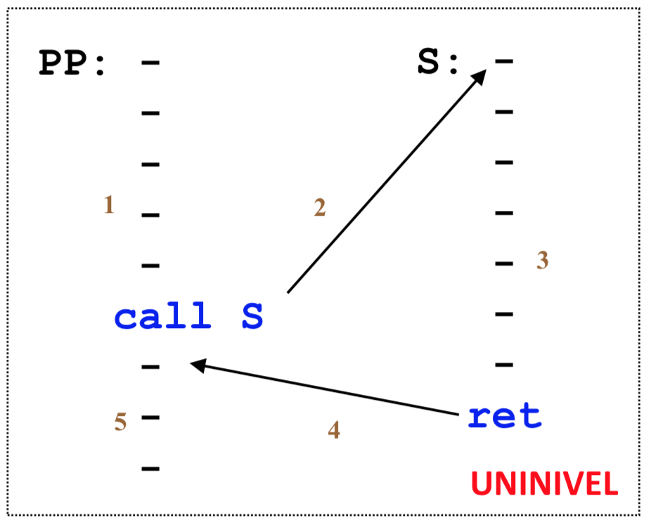
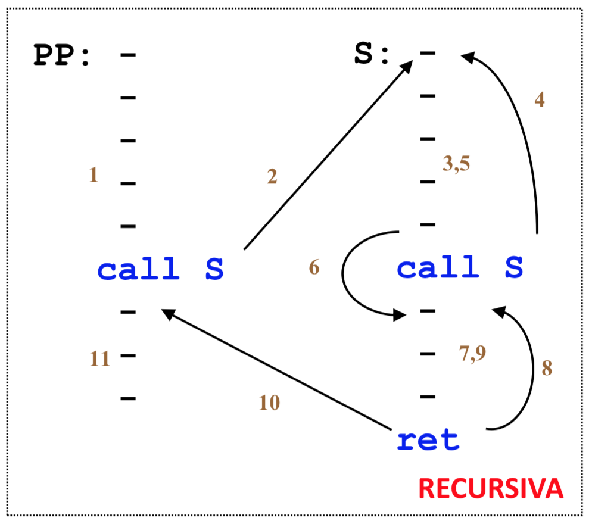
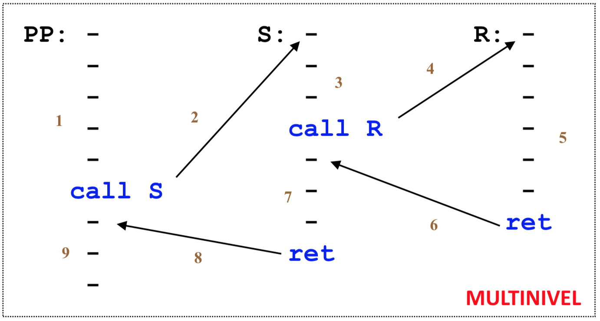
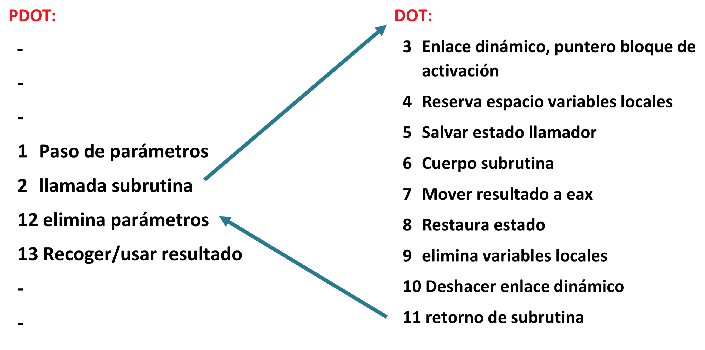

### Optimizaciones de código

1. Entender las matrices como vectores. (desplegar las matrices)

// TO-DO: código página 49

2. Desenrollar los bucles

// TO-DO: página 50

3. Usar instrucciones multimedia (trabajan con más bits a la vez)

// TO-DO: página 51

### Extensiones del lenguaje máquina

#### Coprocesador de coma flotante

<p align="center">
	
</p>

#### 32 bits

<p align="center">
	
</p>

#### Instrucciones multimedia

Son registros de 64 bits.

<p align="center">
	
</p>

#### Mejora de las instrucciones multimedia (el nuestro de las prácticas)

<p align="center">
	
</p>

#### Más registros y más grandes
<p align="center">
	
</p>

### Instrucciones multimedia

<p align="center">
	
</p>

### Estructuras

Esto:

```c
typedef struct {
	int i;
	int a[3];
	int* p;
} X;

int main() {
	X S;
}
```

```c
void init(X* S) {
	(* S).i = 1; // accede al elemento i de S y le pone un 1
	S->a[2] = 0; 	// accede a la posición 2 del elemento a de S y le pone un 0
	S->p = &(* S).a[0];	// Accede a la posición 0 del elemento a de S, coge su dirección y la guarda en el elemento p de S
}
```

Sería esto en memoria:

<p align="center">
	
</p>

Como podemos ver, no es homogéneo.

Al no ser homogéneo, tenemos que alinear los elementos a memoria ya que, para simplificar la descarga de datos. Es decir, por ejemplo, cuando cargue una caché el contenido de los datos siempre estará en esa línea de caché, no estará medio byte en una línea de caché y el otro medio en otra.

### Reglas de alineamiento de Linux-32 (gcc)

|TIPO|ALINEADO A|
|----|----------|
|char|1 byte|
|short|2 bytes|
|int| 4 bytes|
|puntero|4 bytes|
|double|4 bytes|
|long double|4 bytes|

Una estructura también tiene que ir alienada.

**Siempre alineamos la estructura al máximo número de bytes de alineamiento necesario**, qué mal me explico, a ver, si tiene char y int, alineamos a int (ya que requiere más alineamiento que char).

### Linux-64 vs Linux-32

<p align="center">
	
</p>

### Struct ejemplo

```c
struct S1 {
	char c;
	int i[2];
	double v;
}*p;
```

#### Linux-64

<p align="center">
	
</p>

#### Linux-32

<p align="center">
	
</p>

#### El orden de los factores altera el producto

```c
struct S4 {
	char c1;
	double v;
	char c2;
	int i;
}*p;
```

<p align="center">
	
</p>

```c
struct S5 {
	double v;
	char c1;
	char c2;
	int i;
}*p;
```

<p align="center">
	
</p>

### Subrutinas

<p align="center">
	
	
	
</p>

#### Reglas de las subrutinas **(importante)**

##### Parámetros
- Se pasan de izquiera a derecha
- Vectores y matrices --> por referencia
- Structs --> por valor (no importa el tamaño)
- Los char ocupan 4 bytes
- Los short ocupan 4 bytes

##### Variables locales
- Tratar como si todas las variables locales fuesen un struct (en temas de alineamiento).

##### Registros
- **%ebp y %esp** reservados para subrutinas.
- **%ebx, %esi, %edi** salvar si se modifican.
- **%eax, %ecx, %edx** se pueden modificar en las subrutinas.

##### Return
- Siempre guardarlo en el %eax

> La pila siempre está alineada a 4 bytes.

### Ejemplo

```c
void PDOT(int M[10][10], int *p) {
	int i;
	* p = 0;
	for (i = 0; i < 10; i++) {
		* p += DOT(&M[0][0], &M[i][0], 10);
	}
}
```

// TO-DO: rellenar

#### Pasos

<p align="center">
	
</p>
