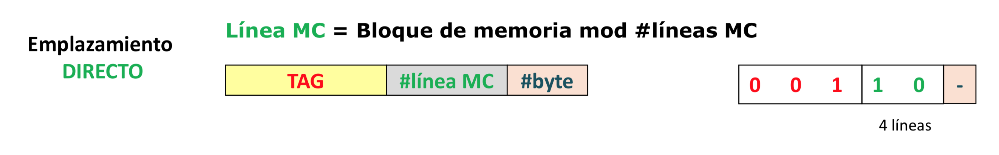
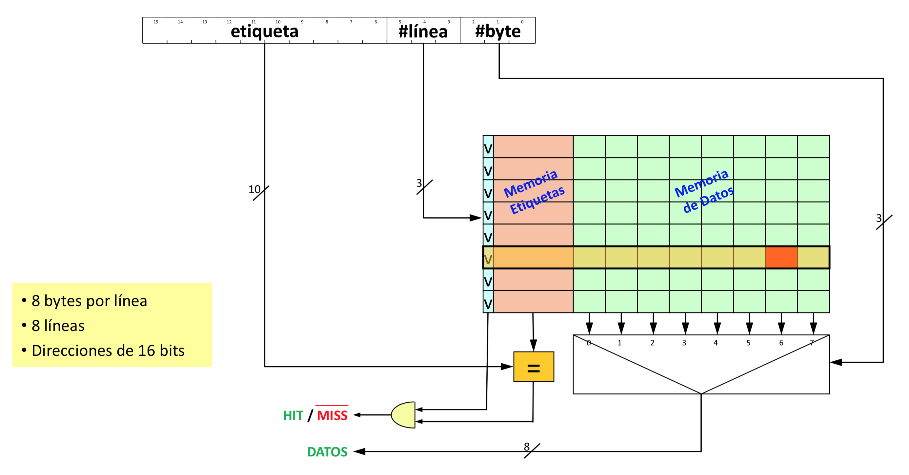
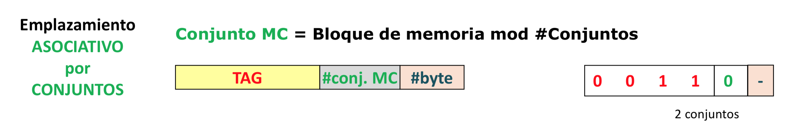
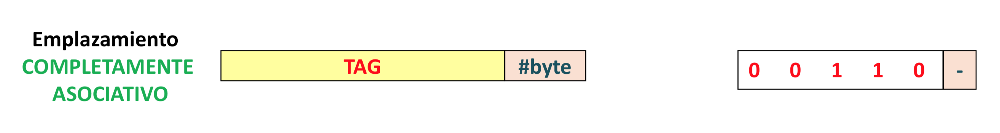
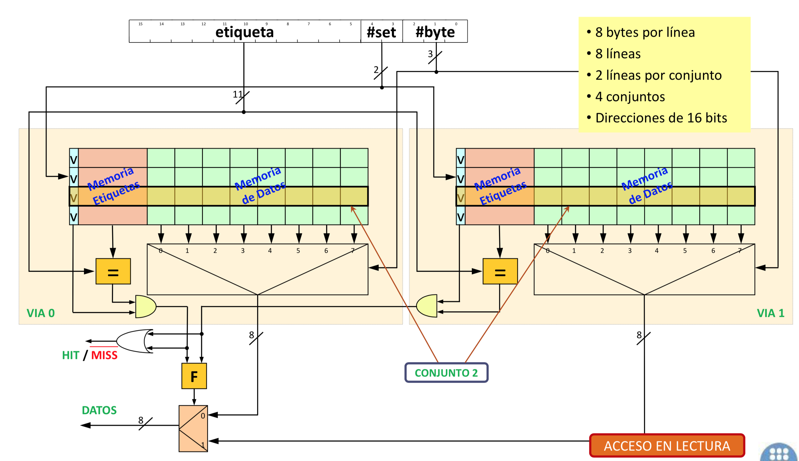
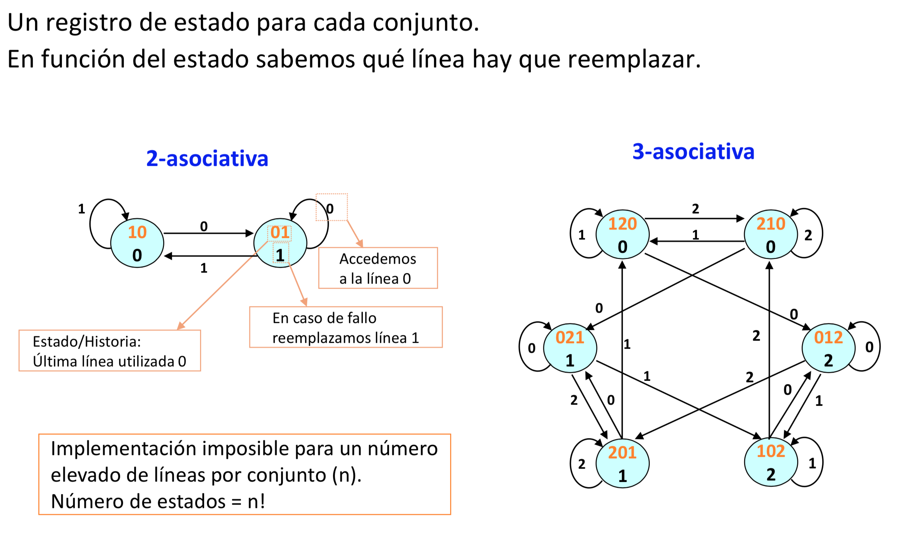
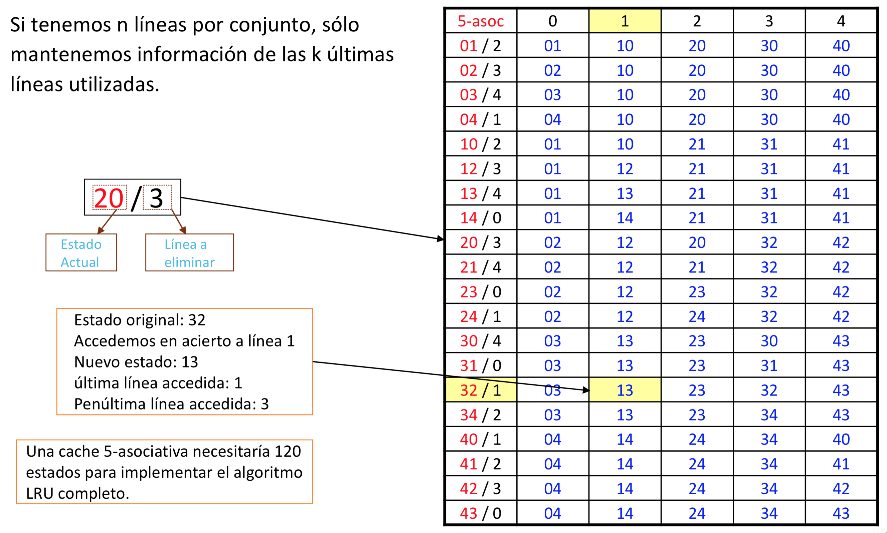
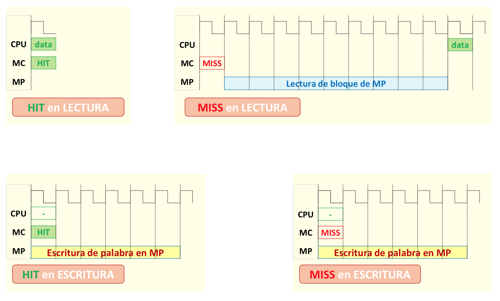
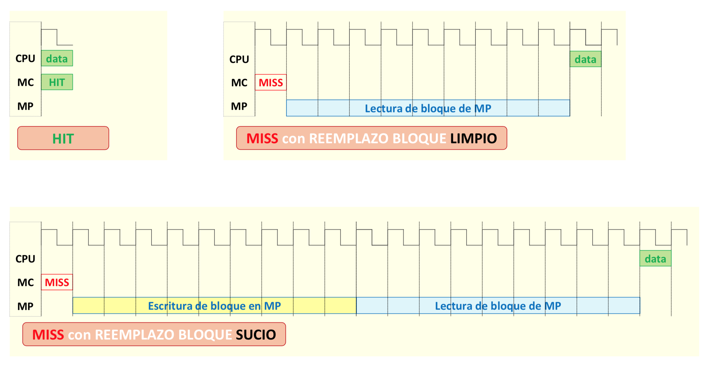

# Conceptos Básicos de Memoria Caché

|Disco|Memoria Principal|Memoria Caché|Procesador|
|-----|-----------------|-------------|----------|
| + lenta |      ...    | ...         |+ rápida  |
| + grande |       ...  |     ...     |+ pequeña |
| + barata |       ...  |     ...     |+ cara    |

> Localidad espacial: si accedes a una posición de memoria, es muy probable que accedamos a posiciones cercanas (por ejemplo en un bucle).

Por lo tanto, si yo accedo a la posición `i` de memoria, me traigo a caché un rango de direcciones consecutivas `i - x`..`i + x` (un bloque entero de datos).

> Localidad temporal: si accedes a una posición de memoria, es muy probable que vuelvas a acceder a la misma posición de memoria.

## Algoritmos de emplazamiento

El algoritmo de emplazamiento determina, dado un bloque de la memoria principal, ¿a qué bloque de la memoria caché va a parar?

#### Correspondencia directa

> Cada bloque va a una posición determinada.

<p align="center">
	
</p>

```cpp
MC = MP % sizeof(MC)	// más o menos
```

Esto lo determinan los bits de menor peso (los bits necesarios).

Para saber a qué bloque de memoria principal pertenece el bloque de la memoria caché se guardan los bits de mayor peso (que combinados con la posición del bloque en memoria caché me da la dirección en memoria principal).

<p align="center">
	
</p>

#### Asociativo por conjuntos

> Partimos la caché en conjuntos y cada línea de memoria principal va a un conjunto. Pero dentro de este conjunto puede ir a cualquier bloque de memoria caché.

<p align="center">
	
</p>

Cogemos los bits de menor peso (los bits necesarios) que nos dirán el número del conjunto. Pero también tengo que guardar la parte de mayor peso para saber a qué posición de memoria principal pertence.

<p align="center">
	
</p>

#### Completamente asociativo

> Cualquier bloque de memoria principal puede ir a cualquier bloque de la memoria caché

<p align="center">
	
</p>

Necesito guardar toda la dirección de memoria principal en caché para poder saber a qué bloque pertenece.

<p align="center">
	
</p>

## Algoritmos de reemplazo

Qué bloque de memoria caché hay que quitar para poner el bloque de memoria principal en caché.

#### LRU

> Siempre se quita el último usado

<p align="center">
	
</p>

#### Pseudo LRU

<p align="center">
	
</p>

#### FIFO

#### Random

## Políticas de escritura

### Write-through with no allocation

<p align="center">
	
</p>

<p align="center">
	
</p>

### Write-back with allocation

<p align="center">
	
</p>

<p align="center">
	
</p>

```assembly
movl A(%eax), %eax		# Si la caché es de 64B, muevo 64/4 = 16 long
movl %eax, A(%eax)		# Depende de la política de escritura
```

### Cuando el elemento está en caché

#### Write-back

> Solamente se escribe en caché cuando el bloque abandona la caché.

#### Write-through

> Se escribe en memoria principal cada vez que se escribe en caché.

### Cuando el elemento no está en caché

#### Write allocate

> Si me bajo la línea a caché.

#### Write no allocate

> Si no me bajo la línea a caché.
