# Conceptos Avanzados de Memoria Caché

Queremos optimizar:

```c
Ttotal = N * CPI * Tc
```

La optimización hay que hacerla en el CPI, tal que:

```c
Ttotal = N * (CPI_ideal + n_ref * miss * t_pen + CPI_wr) * Tc
```

Para reducir los fallos hay que analizar los tipos de fallos.

- Fallos de carga: son fallos causados por la primera introducción en la caché. (no podemos evitar estos fallos).
- Fallos por conflicto: son fallos debidos a la asociatividad de la caché.
- Fallos de capacidad: Todas las líneas del programa no caben en la caché.

> Fallos de coherencia: en los sistemas multiprocesador.

#### Acciones posibles

<p align="center">
	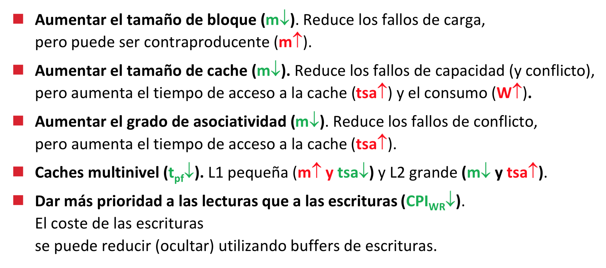
</p>

<p align="center">
	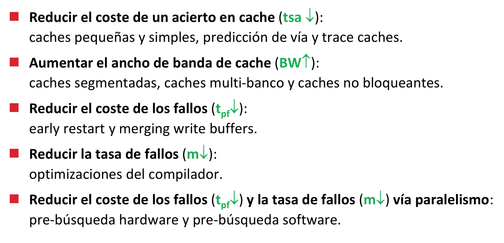
</p>

### Cachés pequeñas y simples (- hit time)

Utilizar cachés pequeñas y simples para reducir el tiempo de acceso en caso de acierto.

### Predicción de vía

Para reducir el tiempo de acceso en cachés asociativas.

#### Paralelo

<p align="center">
	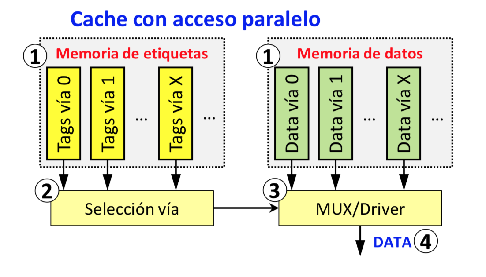
</p>

> Consumo alto. Tiempo de acceso más rápido.

#### Secuencial

<p align="center">
	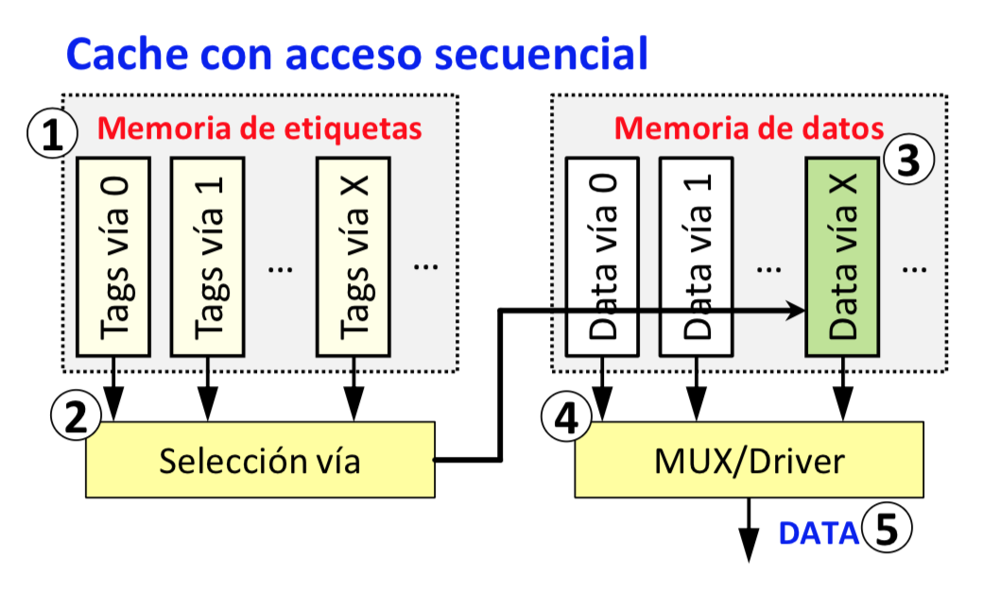
</p>

> Consumo bajo. Tiempo de acceso más lento.

#### Way prediction

<p align="center">
	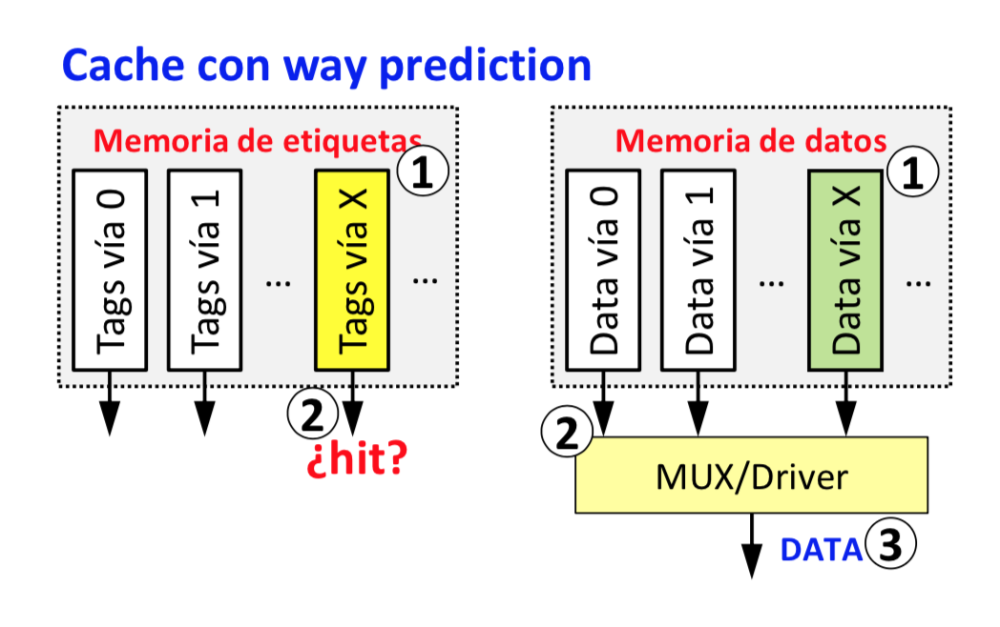
</p>

> Intento adivinar qué vía va a ser. Para ello tengo una tabla, en la que almaceno la vía en la que está guardada la etiqueta. Esta tabla es pequeña. Se direcciona con unos pocos bits.

### Trace cachés

El compilador coge el código y lo parte en bloques básicos: mira todas las direcciones de salto y cada cosa que hay entre dos direcciones, hace un bloque.

<p align="center">
	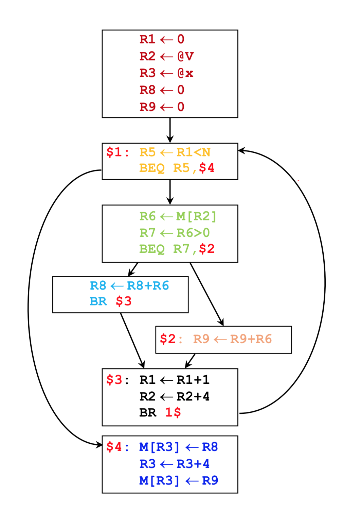
</p>

Una caché normal hace esto:

<p align="center">
	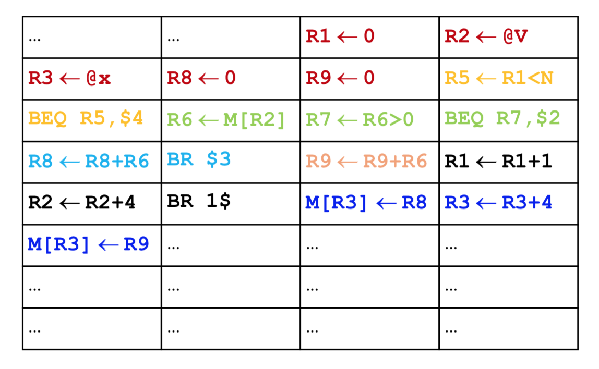
</p>

Una trace caché hace esto:

<p align="center">
	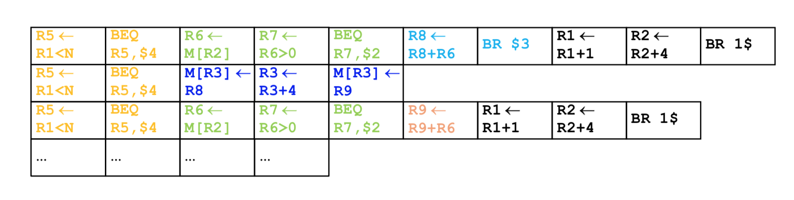
</p>

Tienes diversas rutas (trazas) de ejecución y lo que se tiene que hacer es intentar adivinar por qué traza de ejecución va a tirar el programa.

### Cachés segmentadas (+ ancho de banda)

Pongo un registro en medio del proceso de la caché para guardar la información. Mientras busco el dato en una parte, puedo acceder a una memoria de etiquetas en la otra parte.

<p align="center">
	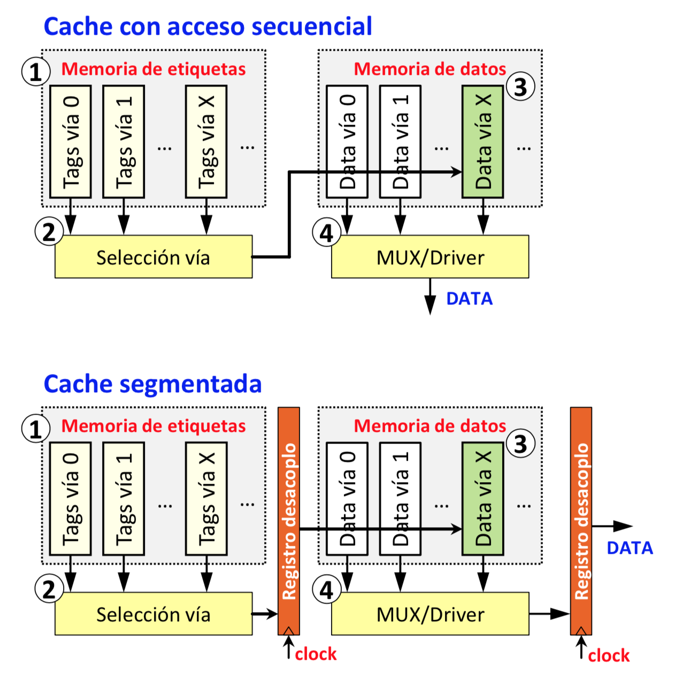
</p>

> El tiempo de reloj de la caché segmentada sería lo que tarde más, las etiquetas o los datos. (si una instrucción accede a memoria, duraría 2 ciclos)

Aunque el tiempo de acceso en caso de acierto sea más lento, transmito más bytes por ciclo ya que cada ciclo estaría dando una dirección de memoria:

<p align="center">
	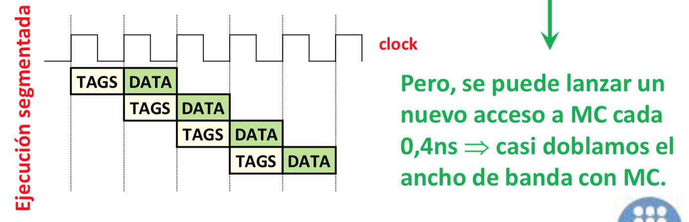
</p>

Puedo segmentar más poniendo más registros dentro de los procesos:

<p align="center">
	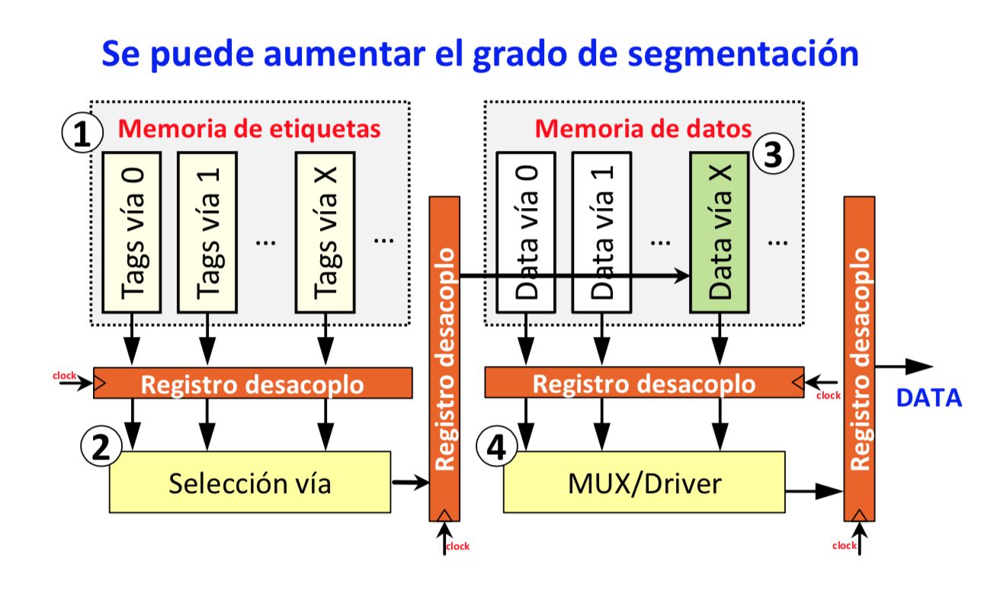
</p>

### Non blocking caché

> Pasar de esto:

<p align="center">
	
</p>

> A esto:

<p align="center">
	
</p>

Para ello usa un **MSHRs (Miss Status Handler Register)** para gestionar los datos pendientes. Los MSHRs guardan el registro destino y cuando llega la información, se mete en el destino.

Para cada línea que falla, se pone un registro destino en el MSHRs.

Como pueden haber dos fallos de la misma línea en diferentes registros, asignamos varios registros por línea en el MSHR.

De este modo, el procesador tan solo se parará cuando necesite un dato que aún no ha llegado y no pueda ejecutar ninguna instrucción antes.
