## Cachés Multibanco

<p align="center">
	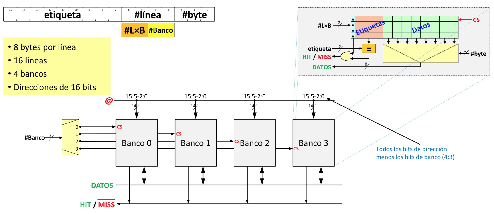
</p>

```cpp
a. A7 A6

(cada 64 direcciones contiguas cambiaría de caché)

- M0 -> 0x00..0x3F
- M1 -> 0x40..0x7F
- M2 -> 0x80..0xBF
- M3 -> 0xC0..0xFF
```

```cpp
b. A1 A0

(cada 1 dirección contigua cambiaría de caché)

- M0 -> @ % 4 == 0
- M1 -> @ % 4 == 1
- M2 -> @ % 4 == 2
- M3 -> @ % 4 == 3
```

```cpp
c. A4 A3

(cada 8 direcciones contiguas cambia de caché)

- M0 -> (@ >> 3) % 4 == 0
- M1 -> (@ >> 3) % 4 == 1
- M2 -> (@ >> 3) % 4 == 2
- M3 -> (@ >> 3) % 4 == 3
```

## Reducir penalización por fallo

#### Actualizar MP después de leer a caché

> Pasamos de esto:

<p align="center">
	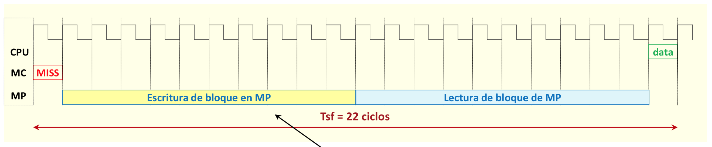
</p>

> A esto:

<p align="center">
	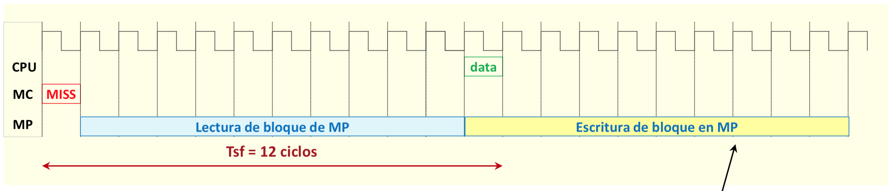
</p>

#### Envío antes el byte de fallo

> Continuación anticipada

- Este es el que se usa (+ rápido).

<p align="center">
	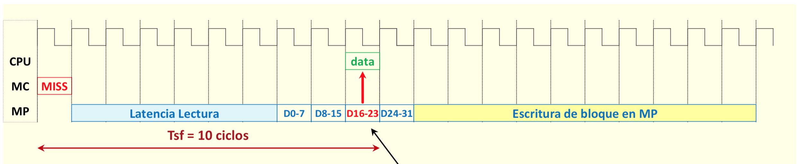
</p>

> Transferencia en desorden + Continuación anticipada

<p align="center">
	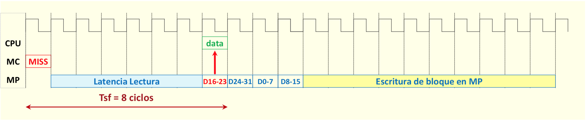
</p>

#### Buffer de lectura

<p align="center">
	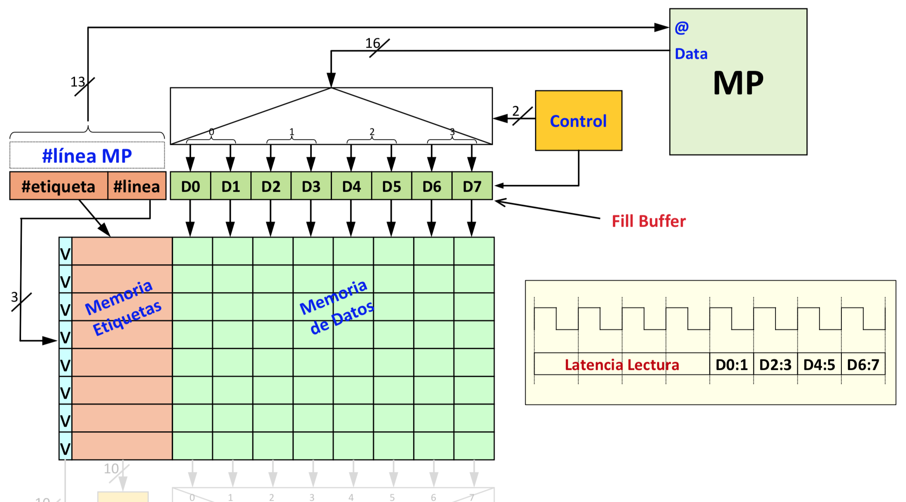
</p>

## Buffer de escritura

#### Copy-back

> Para reducir la penalización en caso de fallo hay que dar prioridad a leer el boque que contiene el dato que provoca el fallo a la escritura en MP del bloque reemplazado.

<p align="center">
	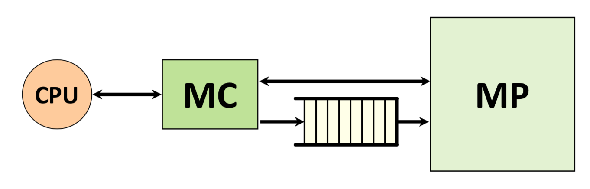
</p>

#### Write-through

> El coste de una escritura es el coste de escribir en Memoria Principal (no es aceptable)

<p align="center">
	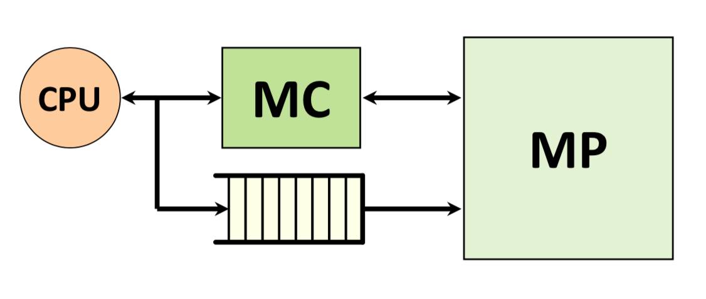
</p>

### Merge buffer (para el write-through)

<p align="center">
	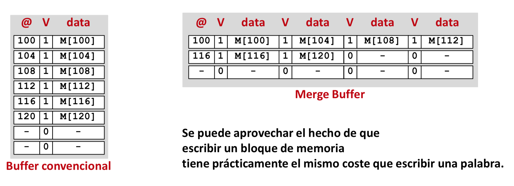
</p>

### Buffer de escritura

<p align="center">
	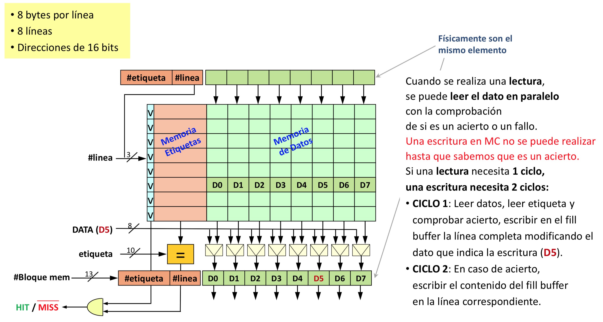
</p>

> La CPU tarda 2 ciclos en leer de caché

##### Pero si añadimos segmentación

<p align="center">
	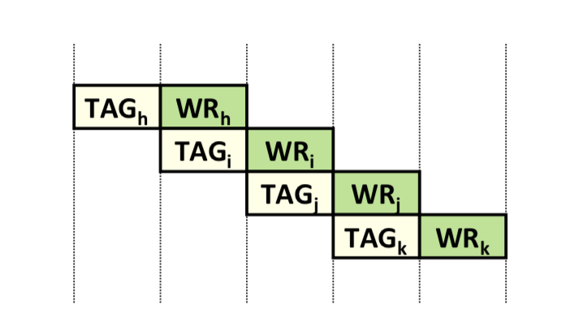
</p>
