## Optimizaciones de código

// TO-DO

# Memoria Principal

```c
m[@] = x	// escritura
x = m[@]	// lectura
```

> La ram es volátil

- Los DVD no son memorias de acceso directo, porque en el DVD tú tienes puntos de acceso y a partir de ese punto, accedo secuencialmente.

> La caché es estática (se guardan en biestables, 6-8 transistores) y la RAM es dinámica (porque se guarda en un condensador, 1-1.x transistores)

#### RAM estática (SRAM)

<p align="center">
	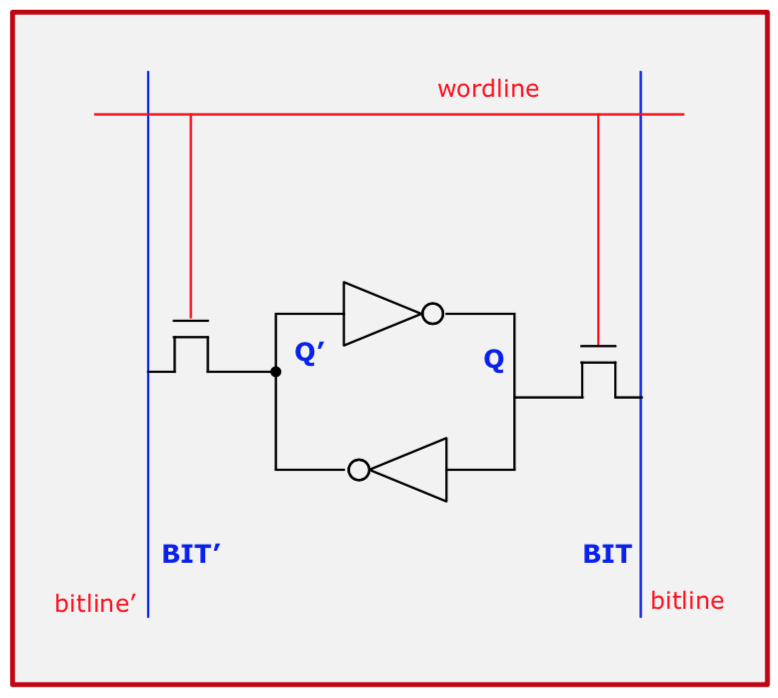
</p>

#### RAM dinámica (DRAM)

> Cuando descargo el condensador, el bit se pierde, por lo tanto, una vez yo hago la operación de lectura, tengo que volver a cargar el condensador con el bit que había.

> Si yo llevo mucho tiempo sin leer el condensador, el condensador se va descargando, así que antes de que se descargue, tengo que volver a cargarlo. Eso se llama **REFRESCO** y se hace unas 20 veces por segundo.

<p align="center">
	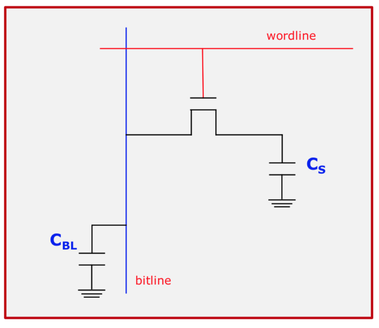
</p>

<p align="center">
	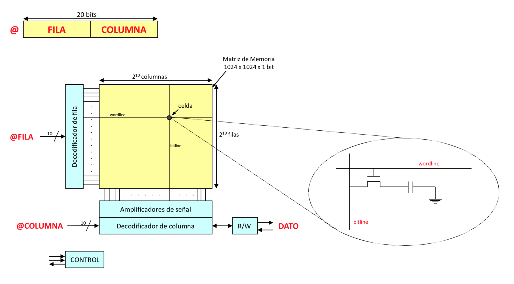
</p>

> Por las mismas patas de la CPU se envía primero los 10 bits de fila y luego los 10 bits de columna. Así leo 1024 bits de golpe.

Abajo hay un amplificador de señal para saber con certeza si es un 0 o es un 1.

Luego me llegan los bits de columna, sé a cual quiero acceder y de esos 1024 envío aquellos que me han pedido.

Finalmente vuelvo a cargar los condensadores con su valor original (al leerlos se descargan).

La **precarga** consiste en dejar el condensador en un estado intermedio de carga y así cuesta lo mismo cargar un 1 que descargar hasta un 0. Si un 1 =~ 5V y un 0 =~ 0V, precargo el condensador a 2,5V para que cargar un 1 no sea tan lento.

<p align="center">
	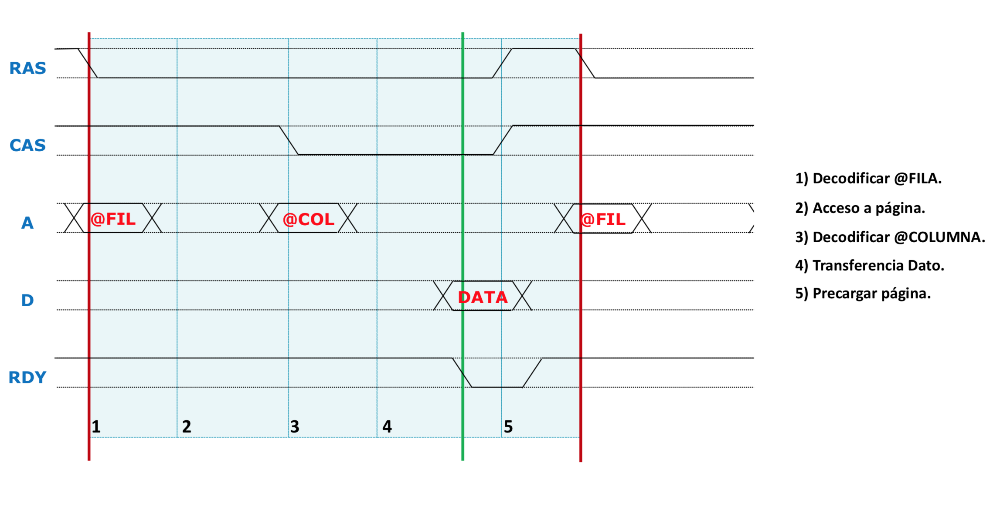
</p>

Antes todo era asíncrono. Y se lanzaban diversas señales (Row Address Strobe / Column Address Strobe / Ready) para indicar diversos estados.

Al ser **asíncrono** era bastante lento.

<p align="center">
	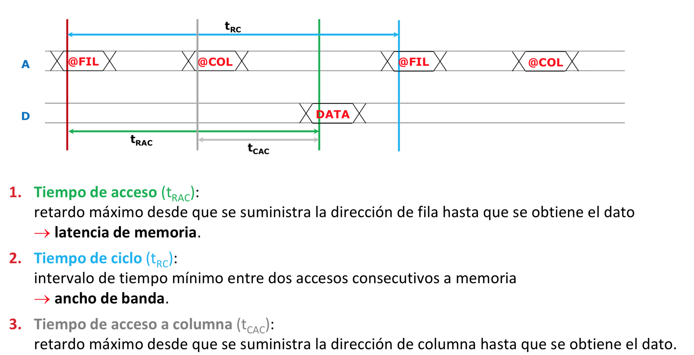
</p>

> Esos tiempo son propios de la RAM.

<p align="center">
	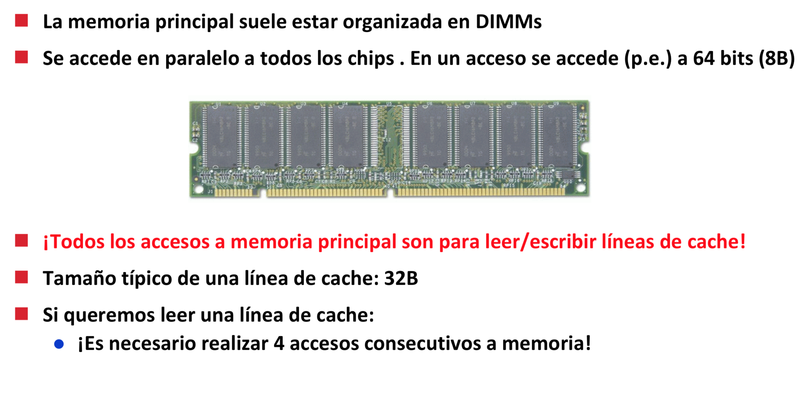
</p>

<p align="center">
	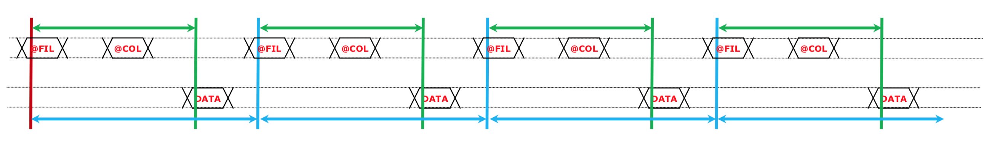
</p>

> Hay que hacer 4 accesos para leer los 32B de una línea de caché.

<p align="center">
	
</p>


### Acceder a diferentes columnas de la misma fila

<p align="center">
	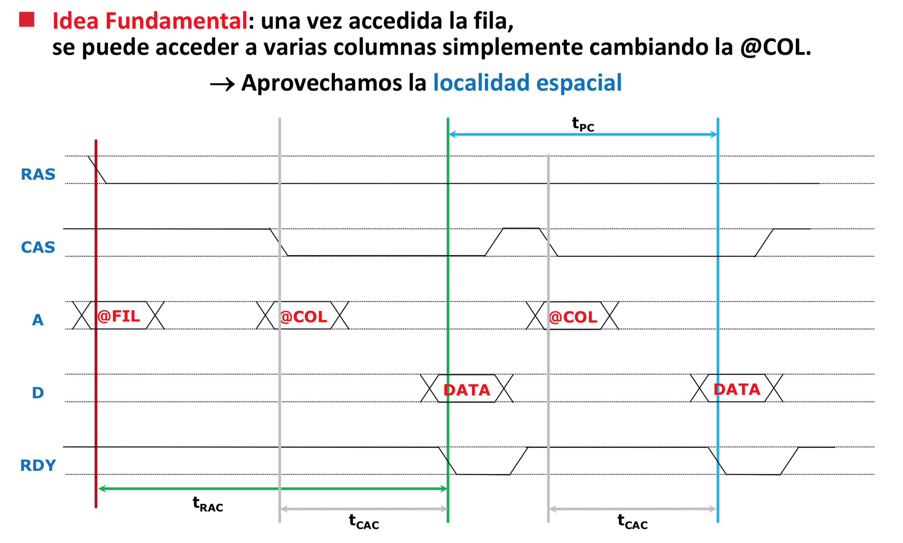
</p>

### Segmentar la salida del dato

> Esto:

<p align="center">
	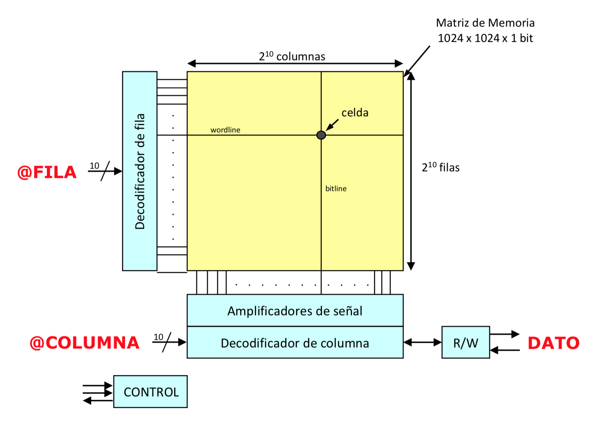
</p>

> Pasa a ser:

<p align="center">
	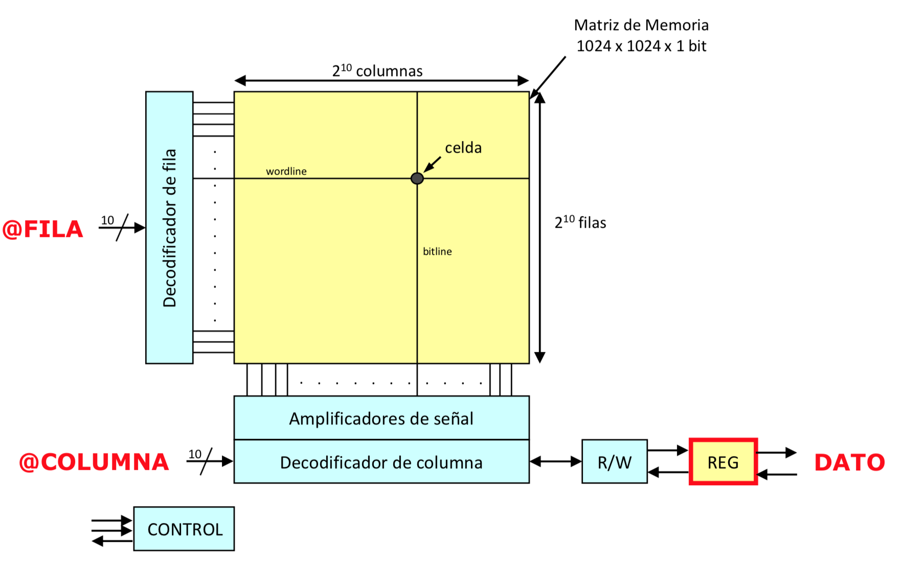
</p>

### Contador para generar col+1, col+2, col+3...

> Esto:

<p align="center">
	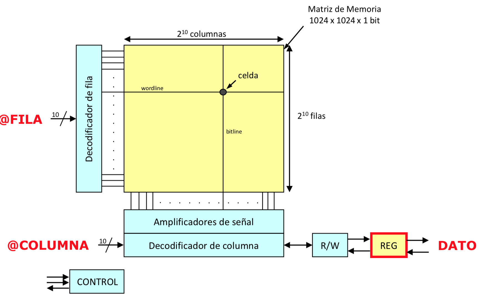
</p>

> Pasa a ser:

<p align="center">
	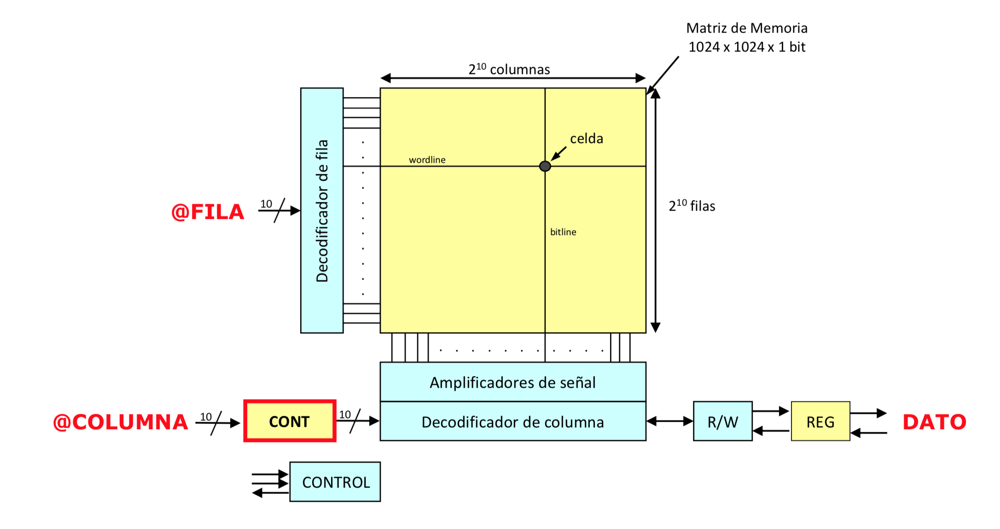
</p>

### Asíncrona --> Síncrona

> Ahora, el fabricante te da un tiempo de ciclo con el cuál ya no necesitas comunicarte con señales.

<p align="center">
	
</p>

### DDR (memorias actuales)

> DDR SDRAM: Double Data Rate Synchronous Dynamic Random-Access Memory

Cada flanco de ciclo se lee un dato.

> Esto:

<p align="center">
	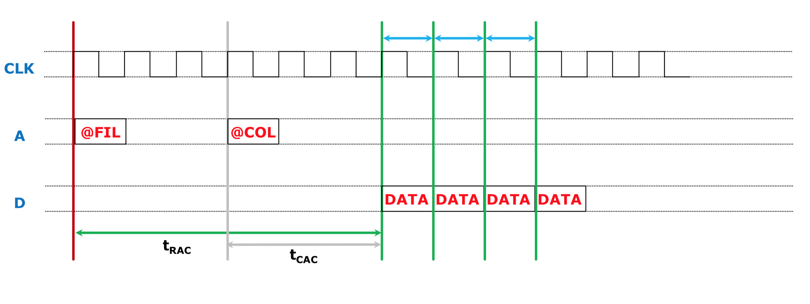
</p>

> Pasa a ser:

<p align="center">
	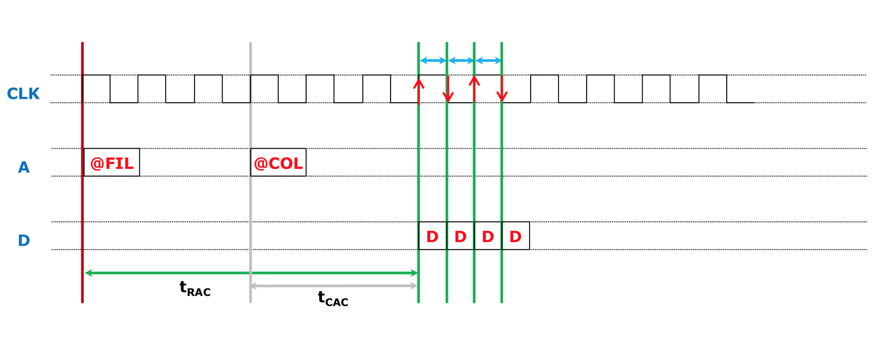
</p>

La memoria se organiza por módulos (bancos) y mientras leo de uno, cargo el dato del otro.

### Unos cronogramas por aquí...

<p align="center">
	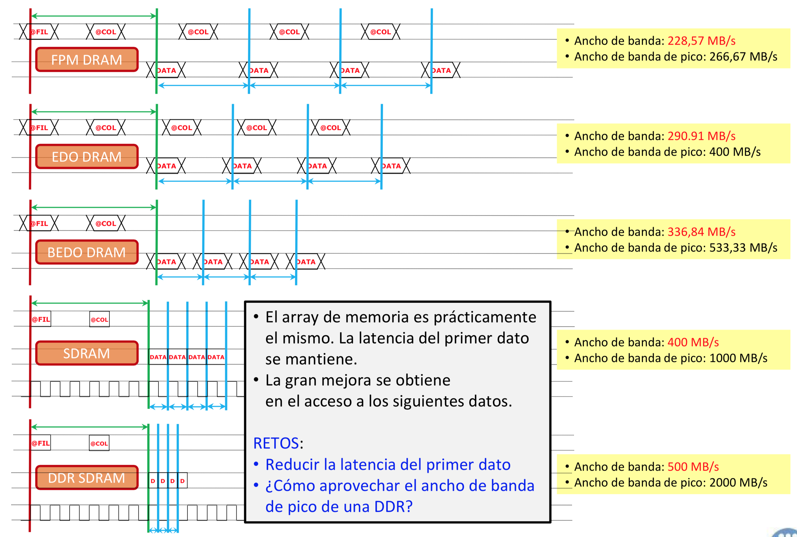
</p>

<p align="center">
	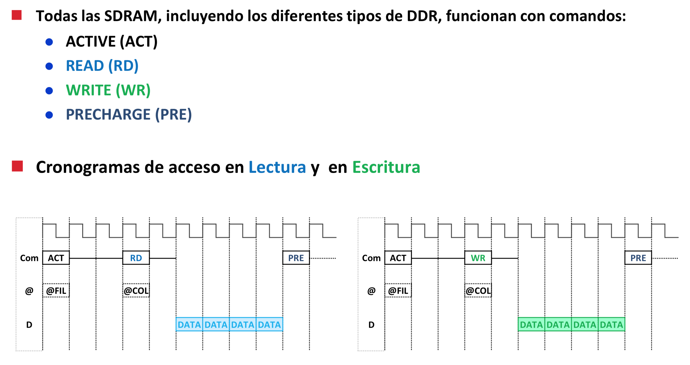
</p>

> IMPORTANTE: ¡El tiempo de ciclo de la memoria no es mismo tiempo de ciclo que el sistema!

<p align="center">
	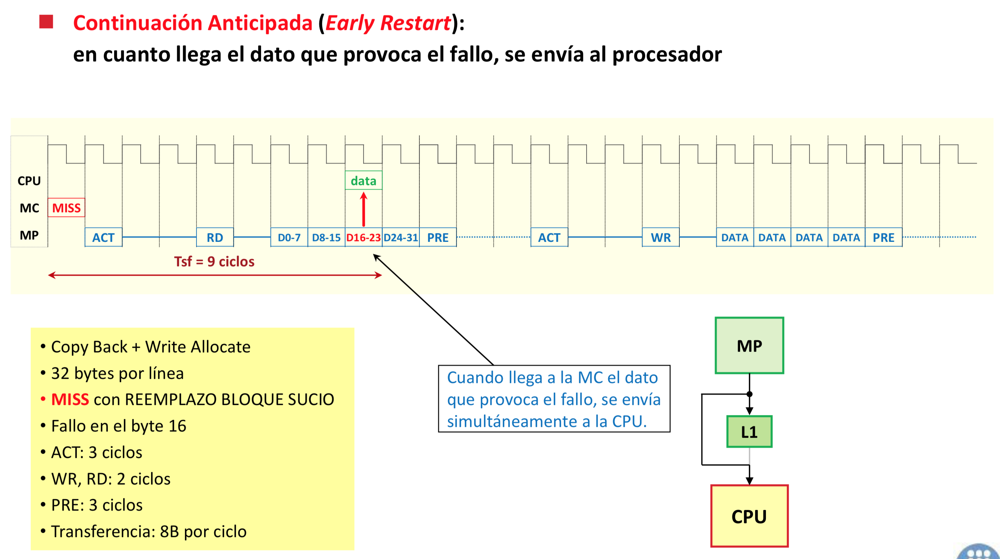
</p>

<p align="center">
	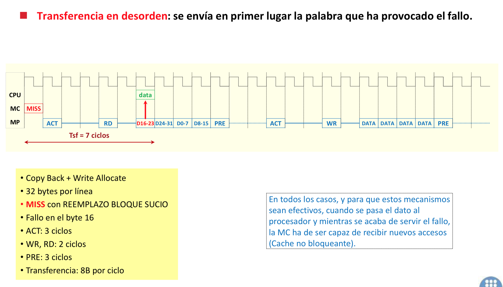
</p>
