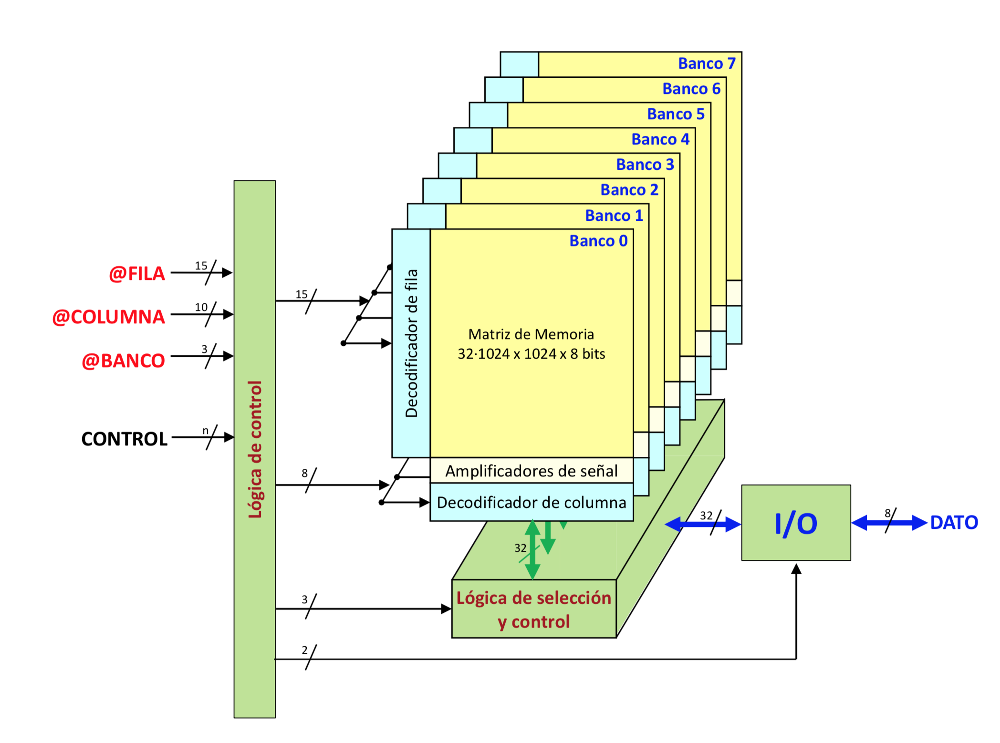
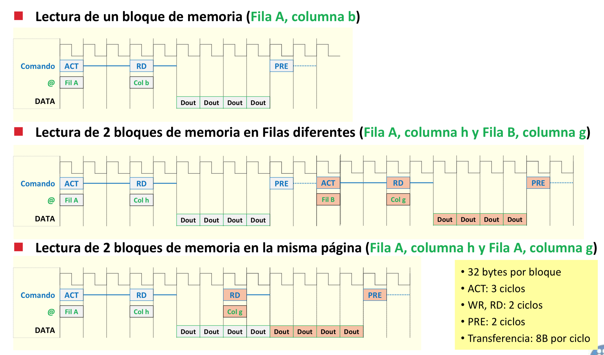
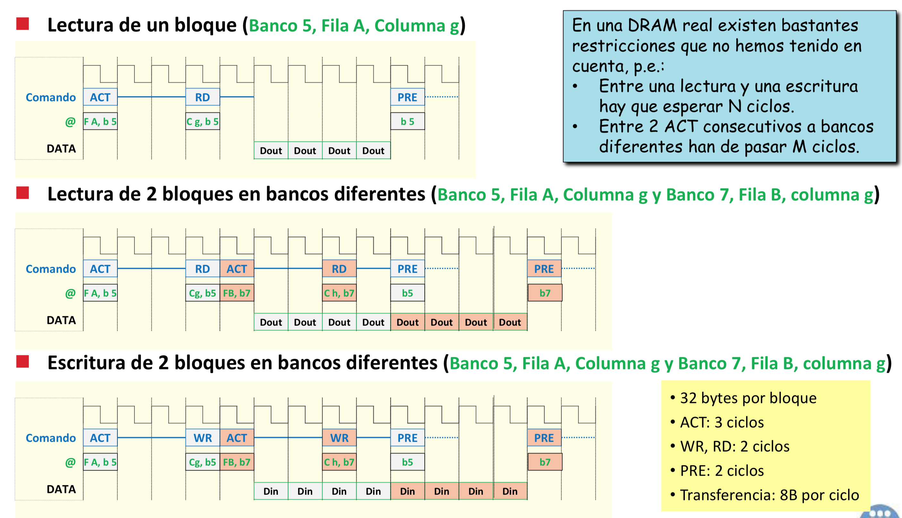
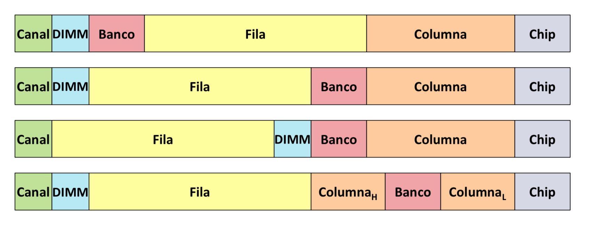
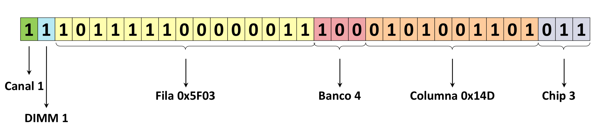
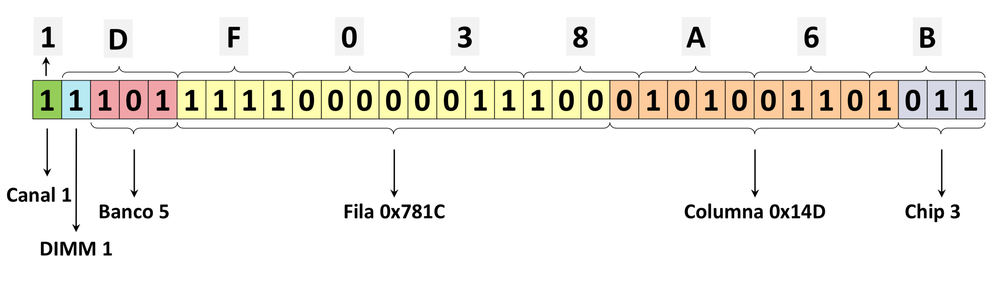
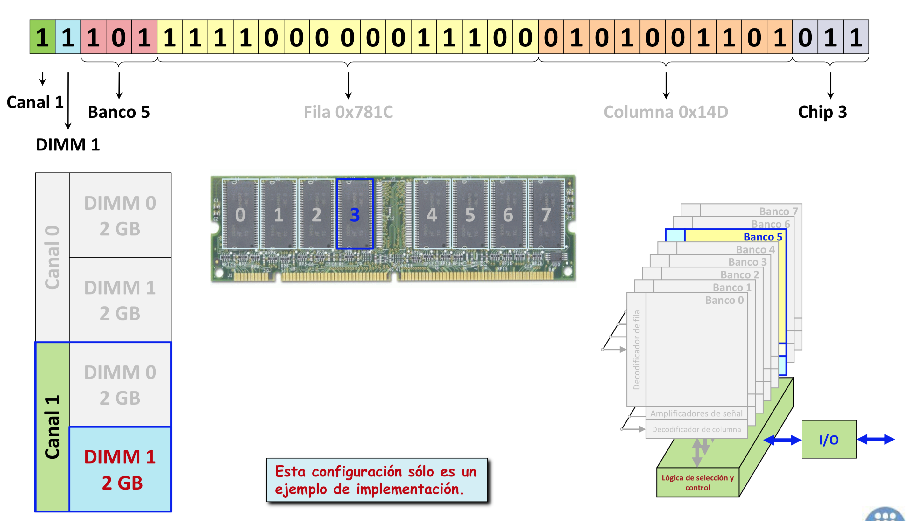
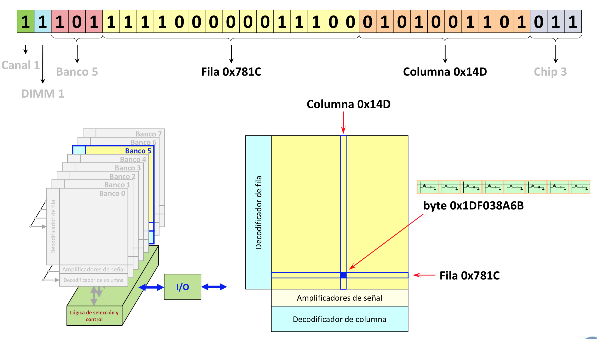

### Bancos

	

> Todas las RAMs se organizan en bancos.

- Para poder acceder a diversos bancos concurrentemente.
- Para ocultar la precarga
- Para ocultar el refresco
- Para que vaya más rápido y que consuma menos (ya que son más peques)

### @Memoria

> En este caso:

- 15 bits de fila
- 10 bits de columna
	- 8 bits de columna
	- 2 bits para seleccionar el byte en la columna
- 3 bits de banco

### Cronogramas

	

	

##### Donde está la dirección 0x1DF038A6B

|   1|1101|1111|0000|0011|1000|1010|0110|1011
|----|----|----|----|----|----|----|----|----|----|----|
|canal|3..1 -> DIM  |  fila  |  fila  | fila   | 3..2 -> fila |  columna  | columna  |  3 -> columna  |
|    | 0 -> fila  |    |    |    | 1..0 -> columna |    |   |  2..0 -> Chip  |

> Conclusión: hay muchas maneras de organizarlo

	

Pero unas son más eficientes que otras.

Me interesa cambiar cada poco tiempo de banco para hacer accesos concurrentes.

> Por lo tanto. Esto:

	

> Es mejor que esto:

	

### Accederiamos así

	

	

> Recomendación: lee las transparencias con calma (no solo las de este resumen, todas las de este tema)

> Mirarse corrección y detección de errores (transparencias)
