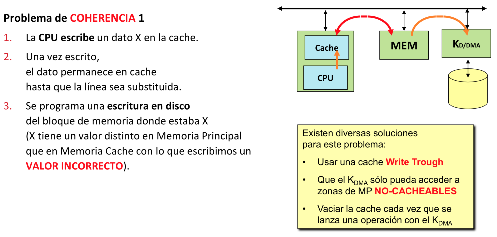
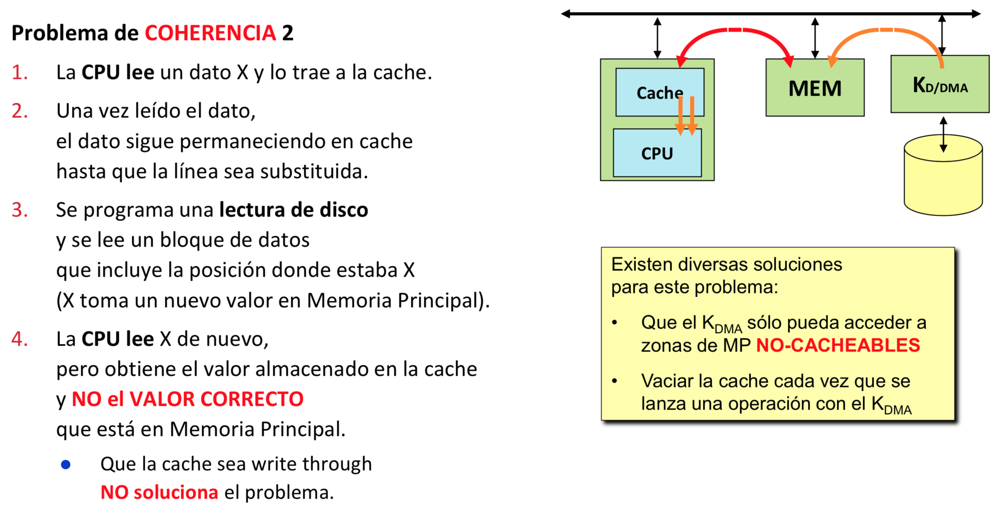
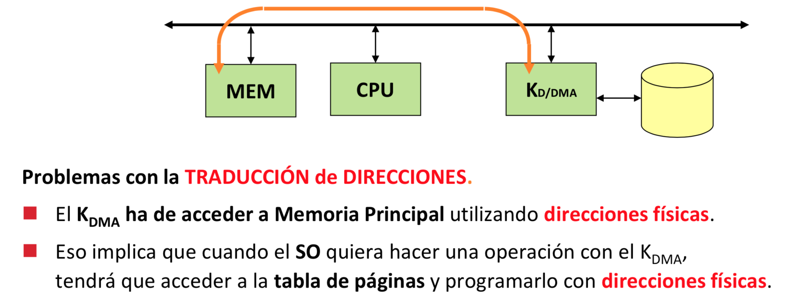
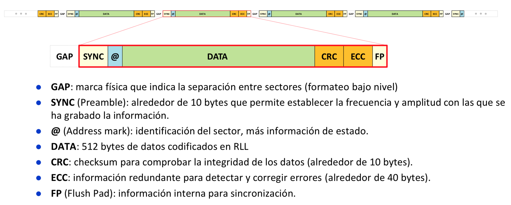

## Interrupciones

La interrupción de reloj es la más importante ya que hace el refresco de la RAM. Se lanza de forma automática 20 veces por segundo.

## Polling

El registro de estado:
- Si tiene un 1 --> hay un controlador que tiene un dato para mí
- Si tiene un 0 --> idle

El registro de datos almacena el dato que tiene el controlador.

> El registro de control controla el envío del dato

Los registros pueden estar mapeados en memoria y entonces harías continuamente un `cmp` de la dirección de memoria con lo que quieras.

También pueden estar en un controlador externo.

## DMA (Direct Memory Access)

Cuando se interrumpe el disco (fallo de página) la CPU coge la interrupción y la rutina de servicio se trae la página que haga falta.

El DMA es un circuito que está conectado directamente a la memoria del disco a la CPU. Cuando llega la interrupción la CPU programa la DMA para que le traiga los datos de disco mientras la CPU aprovecha para ir haciendo otra cosa.

El DMA solamente puede acceder al disco cuando la CPU no lo está usando. La DMA manda un BR (Bus Request) y la CPU cuando le parece bien BG (Bus Granted) y la DMA puede empezar a acceder a disco durante un tiempo.

> ¿Cuánto tiempo? Una ráfaga.

### Problemas de coherencia

<p align="center">
	
</p>

<p align="center">
	
</p>

<p align="center">
	
</p>

## Modos de acceso a disco

### CHS

Antiguo.

> Cylinder Head Sector

### LBA

Los sectores están numerados de 0 a N-1 (N sectores lógicos). Se accede al disco utilizando 1 número de sector lógico.

> Logical Block Addressing

## Parámetros de acceso a disco

#### Average Seek Time

#### Latency

#### RPM

#### Average access time

#### Transfer rate

#### Cache

// TODO

#### MTTF

En vez de usar el MTTF se usa el AFR (Annual Failure Rate).

```c
horas_disco = horas / disco
AFR = (discos * horas_disco) / MTTF
```

#### Interfaz

###### SATA

Cuando transmites información que el cable va cambiando de 0 a 1 y por lo tanto, va crea interferencias electromagnéticas.

Por lo tanto, en vez de usar varios cables (crean interferencias) usamos 1.

## Sectores de disco

<p align="center">
	
</p>

#### CRC

```py
data : bitset<512>
crc = bitset<?>;

while data.size() > 10:
 	crc = data ^ crc
	data = data >> 2
```

#### ECC

### S.M.A.R.T.

## RLL x,y
